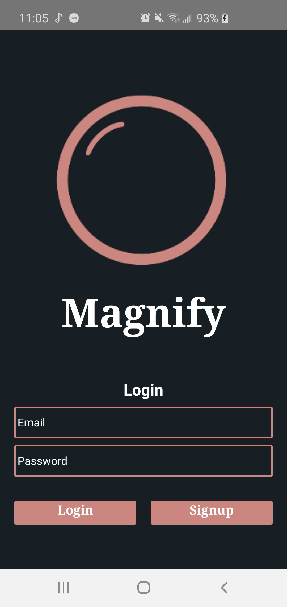
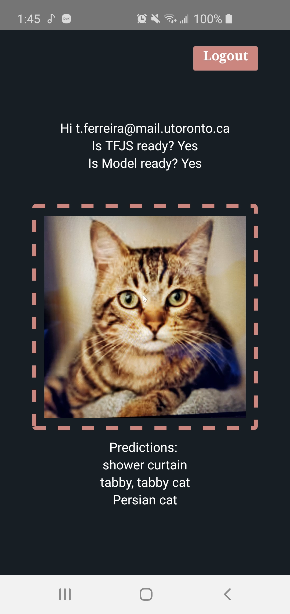

## Description
This is an image classification mobile application that allows users to login in with an account and take photos of an item around them and have it classified by a Tensorflow & MobileNet model. This project was developed using React-Native, Firebase, and TensorflowJS.


## DEMO
 


## STACK
```
React-Native
FireBase
Java
Tensorflow.js
...
```

### Getting Started

#### 1) Clone & Install Dependencies

- 1.1) git clone this repo
- 1.2) cd magnify
- 1.3) Install NPM packages with your package manager of choice - i.e run `yarn` or `npm install`

#### 2) Start your app

- 2.1) Start the react native packager, run `yarn run start` or `npm start` from the root of your project. If this does not work, if on windows run `npx react-native start --reset-cache`.
- 2.2) **[iOS]** Build and run the iOS app, run `npm run ios` or `yarn run ios` from the root of your project. The first build will take some time. This will automatically start up a simulator also for you on a successful build if one wasn't already started.
- 2.3) **[Android]** If you haven't already got an android device attached/emulator running then you'll need to get one running (make sure the emulator is with Google Play / APIs). When ready run `npm run android` or `yarn run android` or `npx react-native run-android` from the root of your project.

### react-native-firebase
This code is A react native app built with [`react-native-firebase`](https://github.com/invertase/react-native-firebase) pre-integrated
- See [LICENSE](/LICENSE)
